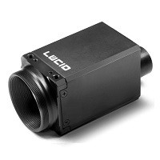
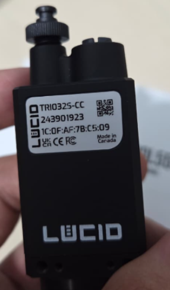

# Camera — Lucid Vision Triton



ROS2 Humble driver for Lucid Vision Triton cameras (GigE Vision), packaged as a Docker container. Supports single and multi-camera setups, JPEG-compressed streaming over LAN or VPN, bag recording, and video export.

Adapted from the [official Lucid Vision ROS2 driver](https://github.com/lucidvisionlabs/arena_camera_ros2) (originally for ROS2 Eloquent).

## Requirements



- Lucid Vision Triton camera connected via GigE (Ethernet)
- ArenaSDK and arena_api files placed in `resources/` (see [Getting Started](../getting-started.md))
- GigE interface configured with `scripts/setup_network.sh`

## Quick Start

```bash
# Configure GigE interface (run on host, not inside container)
sudo ./workspace/camera-lucid/scripts/setup_network.sh <gige-interface>
sudo ip addr add 169.254.1.1/16 dev <gige-interface>

xhost +local:docker
docker compose up -d camera
docker compose exec camera bash

# Inside container — verify camera is detected
python3 /arena_camera_ros2/scripts/list_cameras.py

# Start camera node
ros2 run arena_camera_node start --ros-args \
    -p serial:=<YOUR_SERIAL> \
    -p topic:=/camera/image_raw \
    -p pixelformat:=bayer_rggb8
```

## Directory Structure

```
workspace/camera-lucid/
├── Dockerfile                      # ROS2 Humble + ArenaSDK image
├── docker-compose.yml              # Standalone camera compose
├── config/
│   ├── setup_fastdds.sh            # Generates FastDDS unicast profiles
│   ├── cameras_example.yaml        # Multi-camera config template
│   └── fastdds_*.xml               # FastDDS profiles
├── scripts/
│   ├── setup_network.sh            # GigE interface tuning (MTU, buffers, ring)
│   ├── list_cameras.py             # Detect connected cameras
│   ├── start_camera.sh             # Camera node launcher
│   ├── compress_bayer_stream.py    # JPEG compression relay
│   ├── focus_helper.py             # Live focus score for lens adjustment
│   ├── record_video.py             # Direct MP4 recording
│   ├── bag_to_video.py             # Convert ROS2 bag to MP4
│   └── convert_bag.py              # One-command bag-to-video wrapper
├── notebook_setup/                 # Receiver-side tools
├── launch/
│   ├── multi_camera.launch.py      # Launch multiple cameras from YAML
│   └── camera_streaming.launch.py  # Streaming-optimized launch
└── ros2_ws/src/
    └── arena_camera_node/          # C++ ROS2 node wrapping ArenaSDK
```

## Bayer RAW format

Triton cameras output BayerRG8 natively. Use `pixelformat:=bayer_rggb8` for zero-copy RAW data. When processing in OpenCV:

```python
# ROS2 bayer_rggb8 maps to OpenCV BayerBG (naming is inverted)
bgr = cv2.cvtColor(raw_img, cv2.COLOR_BayerBG2BGR)
```

## Troubleshooting

**Camera not detected:**

- Check the Ethernet cable and camera power
- Run `sudo ./scripts/setup_network.sh <interface>` on the host
- Verify the host IP is on the same subnet: `ip addr show`
- Try `ping <camera-ip>`

**Image is grey or out of focus:**

- Triton cameras ship without a lens — a C-mount lens must be installed separately
- Adjust focus: `python3 /arena_camera_ros2/scripts/focus_helper.py`

**No graphical window:**

- Run `xhost +local:docker` on the host before starting the container

**Compile error: `True not declared`:**

- Fixed in this repository (upstream driver had Python `True` in C++ code)

---

## Node Parameters

All parameters are **startup-only** — the node must be restarted to apply any change.

| Parameter | Type | Description | Default |
|-----------|------|-------------|---------|
| `serial` | int | Camera serial number | first available |
| `topic` | string | ROS2 topic name | `/arena_camera_node/images` |
| `pixelformat` | string | `bayer_rggb8`, `rgb8`, `bgr8`, `mono8`, … | `rgb8` |
| `width` | int | Image width in pixels | camera maximum |
| `height` | int | Image height in pixels | camera maximum |
| `gain` | float | Sensor gain in dB | `0.0` |
| `exposure_time` | float | Exposure in microseconds | camera default |
| `frame_rate` | float | Target acquisition frame rate (FPS) | camera default |
| `trigger_mode` | bool | `true` = triggered, `false` = continuous | `false` |
| `qos_reliability` | string | `reliable` or `best_effort` | `reliable` |

### frame_rate and exposure_time interaction

The actual frame rate is limited by whichever is lower: the `frame_rate` setting or `1 / exposure_time`.

**Example — 33 FPS at full resolution:**
```bash
ros2 run arena_camera_node start --ros-args \
    -p serial:=<YOUR_SERIAL> \
    -p topic:=/camera/image_raw \
    -p pixelformat:=bayer_rggb8 \
    -p frame_rate:=33.0 \
    -p exposure_time:=25000
```

25 ms exposure → allows up to 40 FPS, so the 33 FPS `frame_rate` cap takes effect.

### Using the launch script

```bash
# Inside the container
./scripts/start_camera.sh <serial> <topic> <pixelformat> <width> <height> <gain> <exposure> <fps>

# Example
./scripts/start_camera.sh 12345678 /camera/image_raw bayer_rggb8 "" "" 0 25000 33.0
```

Empty `""` arguments use the camera's maximum resolution.

### Multiple cameras

```bash
cp workspace/camera-lucid/config/cameras_example.yaml workspace/camera-lucid/config/cameras.yaml
# edit cameras.yaml with serial numbers and topic names

ros2 launch /arena_camera_ros2/launch/multi_camera.launch.py \
    config_file:=/arena_camera_ros2/config/cameras.yaml
```

!!! tip "Production deployments"
    For many cameras, use a gigabit switch with Jumbo Frame support and configure static IPs on each camera.

---

## Multi-machine Streaming

Stream camera images from the camera machine to a remote receiver over LAN or VPN.

### Why FastDDS profiles are needed

When a machine has multiple network interfaces (e.g., GigE camera port + WiFi), FastDDS advertises all interface IPs as data locators. The remote subscriber may then try to send ACKs to the GigE camera IP (169.254.x.x), which is not reachable from the remote side.

FastDDS unicast profiles restrict which IP is advertised. The publisher profile also includes the loopback address (`127.0.0.1`) so that co-located processes on the same machine communicate at full speed.

### Bandwidth comparison

| Method | Resolution | Rate | Bandwidth | Notes |
|--------|-----------|------|-----------|-------|
| RAW throttled | 1024×768 | 15 FPS | ~12 Mbps | Low resolution only |
| JPEG compressed q=80 | 2048×1536 | 33 FPS | ~35–45 Mbps | Full res at full rate (WiFi OK) |
| RAW full | 2048×1536 | 33 FPS | ~825 Mbps | Requires 1 GbE link |

JPEG compression is the recommended approach for streaming.

### Setup

#### Camera machine (publisher)

```bash
./workspace/camera-lucid/config/setup_fastdds.sh publisher <streaming-interface>
./workspace/camera-lucid/scripts/start_camera.sh <serial> /camera/image_raw bayer_rggb8 "" "" 0 25000 33.0
bash ./workspace/camera-lucid/notebook_setup/compress_stream.sh /camera/image_raw
```

#### Receiver machine (Docker)

```bash
./workspace/camera-lucid/config/setup_fastdds.sh subscriber <receiving-interface>
sudo bash ./workspace/camera-lucid/notebook_setup/setup_firewall_receiver.sh 192.168.X.0/24

xhost +local:docker
docker compose up -d camera
docker compose exec camera bash

source /opt/ros/humble/setup.bash
python3 /arena_camera_ros2/notebook_setup/stream_viewer.py \
    --topic /camera/image_raw --compressed
```

### Streaming over VPN (NetBird)

Multicast discovery does not work over any VPN tunnel. Use the FastDDS Discovery Server (recommended) or add `initialPeersList` manually:

```xml
<!-- Add inside <rtps> in fastdds_publisher.xml -->
<initialPeersList>
  <locator>
    <udpv4>
      <address>10.X.X.X</address>  <!-- remote peer VPN IP -->
      <port>11811</port>
    </udpv4>
  </locator>
</initialPeersList>
```

### Streaming troubleshooting

**Topic visible but 0 frames received:**

- Most common cause: FastDDS advertising the wrong interface IP
- Run `setup_fastdds.sh` on both machines with the correct interface
- Confirm with `tcpdump -i any udp port 7400` that packets are on the right interface

---

## Recording

### Direct MP4 (recommended)

Records video directly from the camera topic without intermediate files:

```bash
python3 /arena_camera_ros2/scripts/record_video.py --output camera.mp4
# Press Ctrl+C to stop and finalize the file
```

### ROS2 Bag (lossless, for post-processing)

```bash
cd /arena_camera_ros2/bags
ros2 bag record /camera/image_raw -s mcap
```

The bag is stored in `workspace/camera-lucid/bags/` on the host (volume-mounted).

### Convert bag to MP4

```bash
python3 /arena_camera_ros2/scripts/convert_bag.py ./my_bag --output video.mp4
```

### Record only compressed stream

```bash
ros2 bag record /camera/image_raw/compressed -s mcap -o compressed_bag
```
