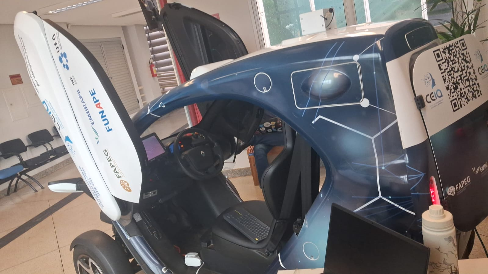
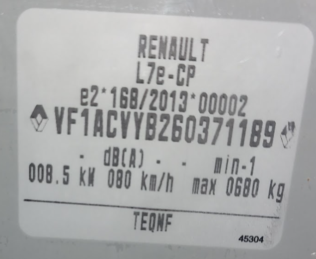
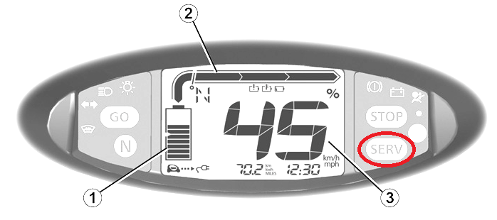
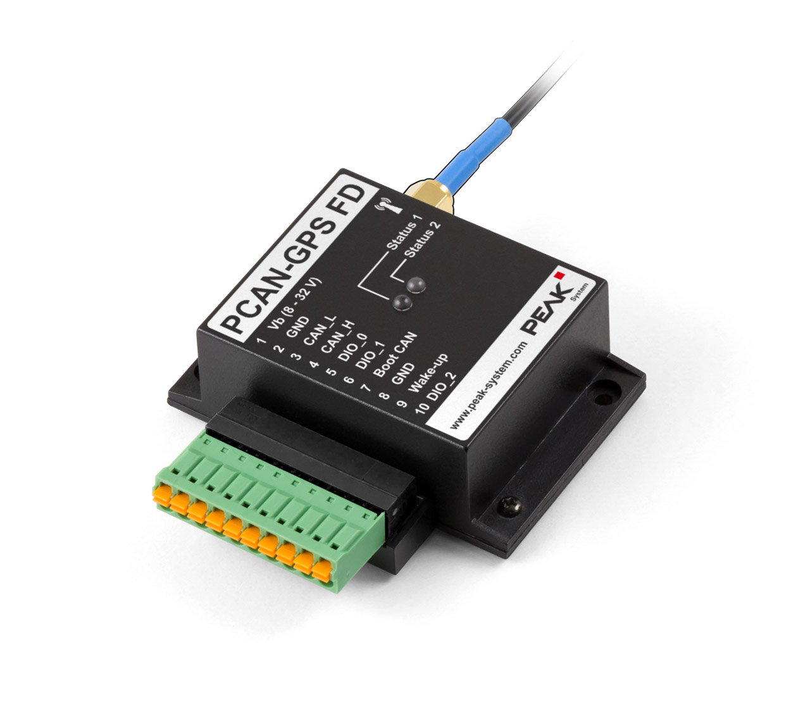
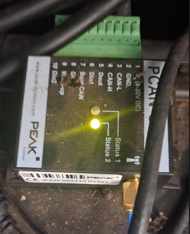
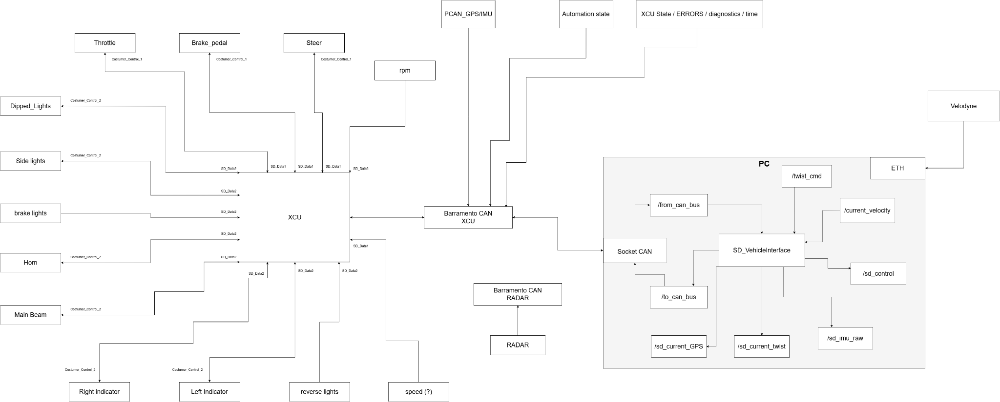

# Hardware do Veículo

## Renault Twizy — Identificação



| Campo | Valor |
|-------|-------|
| Modelo | Renault Twizy 80 |
| Regulamentação EU | L7e-CP e2*168/2013 |
| VIN | VF1ACVYB26037118B9 |
| Ano | 2016 (inferido pelo VIN) |
| Potência nominal | 8,5 kW |
| Velocidade máxima | 80 km/h |
| Carga máxima | 680 kg |



Manual oficial de manutenção: [Renault Xarray Seção 4](https://www.user-manual.renault.com/en/xarray9/section-4-maintenance)

## Sistema Elétrico

### Bateria auxiliar (12V)

A bateria auxiliar de 12V alimenta toda a eletrônica embarcada: PC, sensores, roteador, etc.

| Especificação | Valor |
|--------------|-------|
| Tensão | 12 V |
| Capacidade | 12 Ah ou 14 Ah (original, dependendo da versão) |
| Tipo | Chumbo/Selada AGM (sem eletrólito livre) |
| Unidade atual | Varley Red Top 15 (7065-0005), 12V 15Ah VRLA(AGM) |
| Original | EXIDE 24410 3090R, 12V VRLA(AGM) 14Ah 80A |

!!! warning "Troca da bateria recomendada"
    Fortes indícios de necessidade de troca da bateria auxiliar: envelhecimento (>4 anos), alto volume de ciclagem para alimentar equipamentos de teste, e descarga profunda já reportada. Antes da troca, realizar teste de tensão. Também é necessário fabricar uma fixação pois a unidade Varley atual não se encaixa no suporte original.

**Procedimento seguro de remoção:**

```
Após desligar a ignição → aguardar 35 min → o sistema pode drenar a bateria de
tração para recarregar a auxiliar (para se a tração estiver < 15%). Isolar o
terminal positivo do chassi antes da remoção.
```

### Bateria de tração (lítio, principal)

- O estado de saúde não pode ser lido diretamente — requer scanner OBD2 ou leitura de diagnóstico CAN pelo PC
- Manter o veículo com carga entre 40–60% quando estacionado por períodos prolongados para reduzir degradação acelerada
- Carregar a 100% apenas quando testes de alta quilometragem ou longa duração exigirem

### Carregamento

!!! danger "Aterramento — crítico"
    A tomada do laboratório usada para carregar o veículo deve ter **aterramento correto**. Houve múltiplas falhas no carregador embarcado por falhas de aterramento. É necessária uma **tomada de 20A** — não usar tomadas de 10A (a corrente de carga se aproxima do limite de 10A e má conexão adiciona risco de superaquecimento e incêndio). Atualmente um adaptador genérico está em uso e deve ser substituído.

## Estado Mecânico



| Sistema | Status / Observações |
|---------|---------------------|
| Luz de serviço | ACESA — necessária inspeção eletrônica/mecânica |
| Pneus | Verificar deformações ou rachaduras; calibrar pressão |
| Tamanho dos pneus | Dianteiro e traseiro diferentes — verificar spec antes de comprar |
| Discos de freio | Camada superficial de ferrugem; ciclo de rodagem recomendado |
| Fluido de freio | Troca recomendada; verificar vazamentos embaixo da caixa de direção |
| Fluido da transmissão | Sem necessidade de troca a menos que o veículo ficou parado >2 anos |
| Correia (StreetDrone) | Verificar estado da correia do atuador de freio autônomo |
| Conectores | Inspecionar encaixe correto, sem trincas ou travas quebradas |
| Pontos de aterramento | Testar resistência (deve ser <300 mΩ conforme ISO 6469-3:2011) |
| Bateria de tração | Diagnóstico OBD2 / CAN necessário para avaliar estado de saúde |

## OBD2 / Diagnóstico

O conector OBD2 fica acessível ao retirar a tampa de plástico próxima ao freio de mão. Um scanner automotivo é recomendado para ler códigos de falha antes de encomendar peças de reposição.

Também é possível ler dados de diagnóstico diretamente pelo PC do veículo via porta CAN disponível, mas requer compreensão da estrutura dos dados de diagnóstico (IDs de parâmetros, PIDs) e cuidado para não injetar comandos que possam afetar a segurança do veículo.

---

## Sensores

### PCAN-GPS FD (PEAK System)

O módulo PCAN-GPS FD fornece dados de IMU e GPS via barramento CAN, publicados como tópicos ROS2.



| Especificação | Valor |
|--------------|-------|
| Microcontrolador | NXP LPC4000 series (ARM Cortex-M4) |
| Receptor GNSS | u-blox MAX-7W (GPS, GLONASS, QZSS, SBAS) |
| Acelerômetro + Magnetômetro | Bosch BMC050 (3 eixos cada) |
| Giroscópio | STMicroelectronics L3GD20 (3 eixos) |
| CAN | High-speed CAN (ISO 11898-2), 40 kbit/s a 1 Mbit/s |
| Protocolo CAN | CAN 2.0 A/B |
| Entradas digitais | 2 (High-active) |
| Saída digital | 1 (Low-side driver) |
| Conector | Régua de terminais Phoenix de 10 polos |
| Alimentação | 8 a 30 V DC |
| Armazenamento | Slot microSD (data logging) |
| Temperatura de operação | -40 a +85 °C |

**Resultados dos testes:**

- **IMU:** Acesso aos dados brutos (raw data) realizado com sucesso via barramento CAN e tópicos ROS2
- **GPS:** Coordenadas não obtidas nos testes — testes realizados em ambiente fechado (indoor), sem sinal de satélite



### Arquitetura do Barramento CAN



### Lucid Vision TRI032S-CC

| Especificação | Valor |
|--------------|-------|
| Modelo | LUCID Triton TRI032S-CC |
| Serial | 243901923 |
| Sensor | Sony IMX265 CMOS (Global Shutter) |
| Resolução | 3,2 MP (2048 × 1536 px) |
| Taxa de quadros | ~35,4 FPS (base) |
| Interface | GigE Vision (1000BASE-T via conector M12) |
| Tamanho do sensor | 8,9 mm (tipo 1/1,8") |
| Tamanho do pixel | 3,45 µm |
| Montagem de lente | C-Mount |
| Proteção | IP67 (resistente a poeira e água) |
| Alimentação | PoE (Power over Ethernet) ou 12–24 VDC externo |

**Status operacional:**
- Feed rodando em ~30 FPS, visível na mini tela do veículo
- Bug de inicialização multi-câmera (conflito de ID de câmeras) — corrigido
- Transmissão via VPN NetBird: estável; tópicos acessíveis; rqt não funcional via VPN (usar script Python viewer no lugar)

!!! note "Lente"
    A TRI032S-CC não vem com lente. Uma lente C-Mount deve ser instalada. A ausência de lente foi identificada e corrigida durante a configuração inicial.

### PC de Bordo

- SO: Ubuntu 22.04 LTS
- Pacotes ROS2 Humble inicializados com sucesso
- Visualização de tópicos confirmada no ROS2
