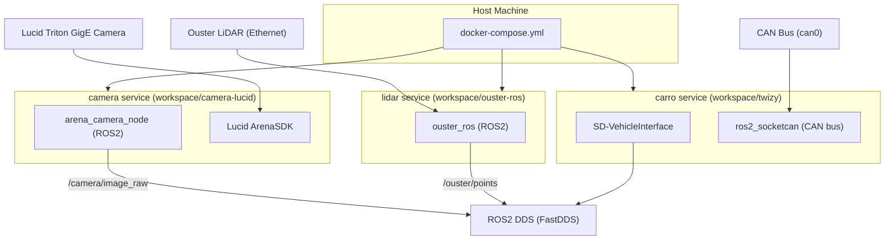

# AIR Twizy Hardware

Central hardware stack for the AIR-UFG team's autonomous Twizy vehicle. This repository orchestrates three independent subsystems — camera, LiDAR and vehicle interface — through a unified Docker Compose setup.

## Architecture



## Subsystems

| Subsystem | Directory | Hardware | ROS2 Package |
|-----------|-----------|----------|--------------|
| Camera | `workspace/camera-lucid` | Lucid Vision Triton (GigE) | `arena_camera_node` |
| LiDAR | `workspace/ouster-ros` | Ouster OS-series | `ouster_ros` |
| Vehicle | `workspace/twizy` | StreetDrone Twizy (CAN) | `SD-VehicleInterface` |

Each subsystem lives in a separate git submodule and has its own Docker image. The root `docker-compose.yml` ties them together with a shared `ROS_DOMAIN_ID` and host networking.

## Quick Start

```bash
git clone https://github.com/AIR-UFG/air_twizy_hardware.git
cd air_twizy_hardware
git submodule update --init --recursive

cp env.exemple .env
# edit .env with your camera serial, CAN port, etc.

docker compose build
docker compose up -d
```

See [Getting Started](getting-started.md) for detailed setup instructions.
