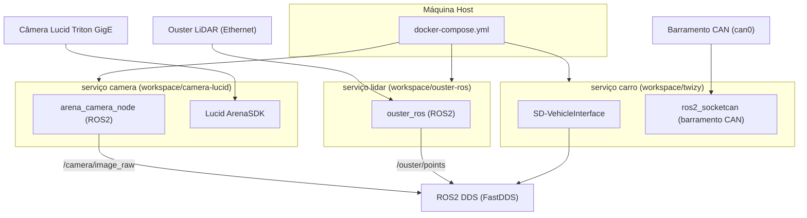

# AIR Twizy Hardware

Stack de hardware central para o veículo Twizy autônomo da equipe AIR-UFG. Este repositório orquestra três subsistemas independentes — câmera, LiDAR e interface do veículo — por meio de um único Docker Compose.

## Arquitetura



## Subsistemas

| Subsistema | Diretório | Hardware | Pacote ROS2 |
|-----------|-----------|----------|--------------|
| Câmera | `workspace/camera-lucid` | Lucid Vision Triton (GigE) | `arena_camera_node` |
| LiDAR | `workspace/ouster-ros` | Ouster OS-series | `ouster_ros` |
| Veículo | `workspace/twizy` | StreetDrone Twizy (CAN) | `SD-VehicleInterface` |

Cada subsistema vive em um submódulo git separado e possui sua própria imagem Docker. O `docker-compose.yml` raiz os integra com `ROS_DOMAIN_ID` compartilhado e rede host.

## Início Rápido

```bash
git clone https://github.com/AIR-UFG/air_twizy_hardware.git
cd air_twizy_hardware
git submodule update --init --recursive

cp env.exemple .env
# edite .env com serial da câmera, porta CAN, etc.

docker compose build
docker compose up -d
```

Veja [Primeiros Passos](getting-started.md) para instruções detalhadas.
