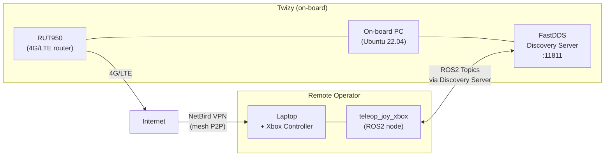
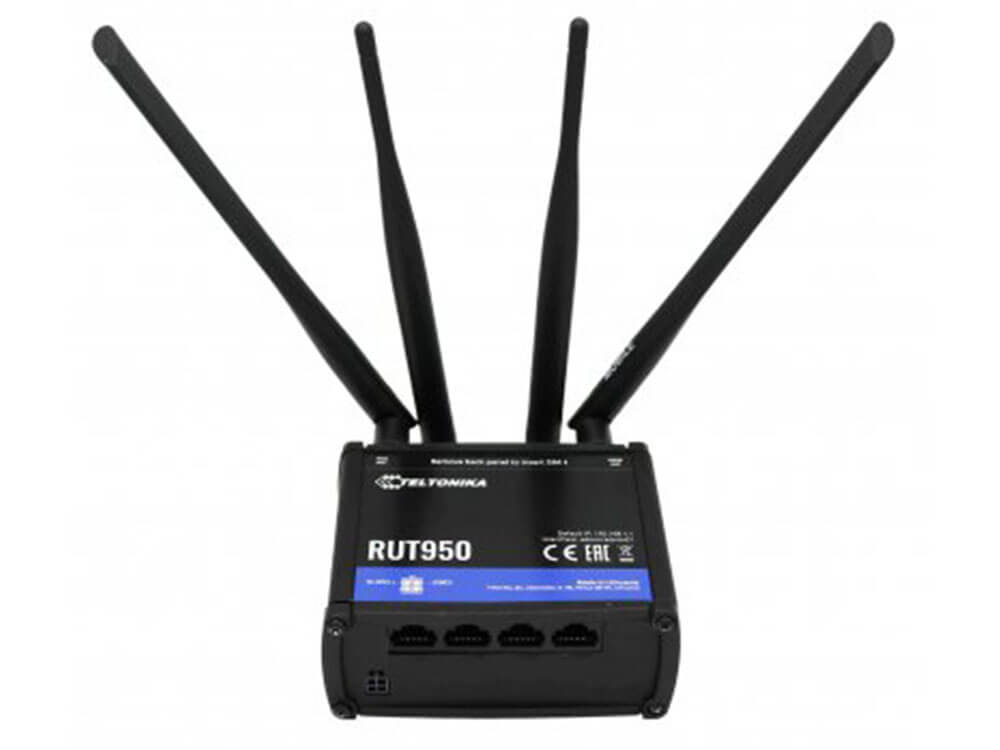
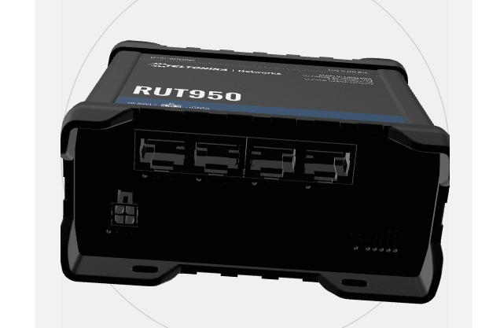

# Networking

The Twizy uses a **Teltonika RUT950** industrial 4G/LTE router as its onboard network gateway, combined with a **NetBird mesh VPN** to enable secure remote access to all ROS2 nodes from anywhere with internet connectivity.

## Architecture



## RUT950 Router

The Teltonika **RUT950** provides mobile connectivity to the vehicle.



| Spec | Value |
|------|-------|
| Technology | 4G LTE Cat 4 (up to 150 Mbps download), 3G, 2G |
| SIM | Dual SIM with automatic failover |
| WiFi | IEEE 802.11b/g/n (AP + STA) |
| Ethernet | 4 ports × 10/100 Mbps (1 WAN + 3 LAN) |
| CPU | Atheros Wasp, MIPS 74Kc, 550 MHz |
| RAM | 128 MB DDR2 |
| Storage | 16 MB Flash |
| Power | 9–30 VDC (4-pin industrial connector) |
| OS | RutOS (OpenWrt-based Linux) |
| Housing | Aluminium with plastic panels |



!!! note "Physical installation"
    The router's WiFi/config credentials are on a label on the back of the device. A 3D-printed bracket is needed to mount it in the rear of the vehicle.

!!! warning "SIM card"
    Connectivity was validated with a test SIM. A dedicated SIM plan must be purchased for production use.

---

## NetBird VPN

NetBird creates an encrypted mesh VPN between all team devices. Each machine gets a stable hostname and IP on the NetBird network regardless of its physical network or NAT.

### Why NetBird

- No static IP needed on the vehicle — the RUT950 has a dynamic 4G IP
- Peer-to-peer when possible (low latency), relay fallback when NAT blocks direct connection
- Works over 4G, WiFi, and any internet connection
- Free tier available for small teams (self-hosted or cloud)

### Installation (all machines)

```bash
curl -fsSL https://pkgs.netbird.io/install.sh | sh
```

### Authentication and connection

```bash
# Generate an authentication token in the NetBird dashboard (cloud or self-hosted)
sudo netbird up --setup-key <generated_token>
```

### Verification

```bash
netbird status
# Both the vehicle and the operator machine should appear as "Connected"

ping twizy
```

### Network considerations for ROS2

The ROS2 Docker containers must use `network_mode: host` so that ROS2 traffic is routed through the NetBird interface (`wt0`) rather than being isolated inside Docker's bridge network.

```yaml
services:
  carro:
    network_mode: host   # required — routes ROS2 over NetBird wt0
```

!!! warning "Camera GigE interface conflict"
    The FastDDS Discovery Server must be configured to listen only on the NetBird interface (`wt0`), **not** on the GigE camera interface (`169.254.x.x`). Running the server on all interfaces caused a conflict that prevented the camera from connecting.

```bash
ip addr show wt0
# Should show a 100.x.x.x address assigned by NetBird
```

---

## FastDDS Discovery Server

Standard ROS2 relies on multicast for node discovery, which does not work across VPN tunnels or between machines on different networks. The solution is a **centralized FastDDS Discovery Server** running on the vehicle, which all nodes (local and remote) register with via unicast.

### How it works

```mermaid
sequenceDiagram
    participant V as Vehicle PC
    participant DS as Discovery Server (port 11811)
    participant O as Remote Operator

    V->>DS: register nodes (local, via 127.0.0.1 or wt0)
    O->>DS: register nodes (via NetBird IP)
    DS-->>V: peer list
    DS-->>O: peer list
    V<-->>O: ROS2 topic exchange (unicast)
```

### Setup on the vehicle

```dockerfile
FROM ros:humble-ros-core
RUN apt-get update && apt-get install -y \
    ros-humble-rmw-fastrtps-cpp \
    fastdds-tools \
    && rm -rf /var/lib/apt/lists/*
ENTRYPOINT ["fastdds", "discovery"]
```

```yaml
services:
  discovery-server:
    build:
      context: .
      dockerfile: Dockerfile.server
    container_name: fastdds_server
    network_mode: "host"        # must use host to reach NetBird wt0 interface
    command: -i 0               # discovery server ID 0
    restart: unless-stopped
```

```bash
docker compose up -d discovery-server

# Or without Docker:
source /opt/ros/humble/setup.bash
fastdds discovery -i 0
```

!!! warning "GigE camera conflict"
    Running the Discovery Server without binding it to a specific interface caused it to advertise on the camera's GigE interface (`169.254.x.x`), blocking camera connections. Using `network_mode: host` combined with the NetBird-only FastDDS profile resolves this.

### Environment variables

**Vehicle side:**

```bash
ROS_DOMAIN_ID=0
RMW_IMPLEMENTATION=rmw_fastrtps_cpp
```

**Operator side:**

```bash
export ROS_DISCOVERY_SERVER=twizy:11811   # NetBird hostname of the vehicle
export ROS_SUPER_CLIENT=true              # disables multicast, forces Discovery Server usage
export ROS_DOMAIN_ID=0
export RMW_IMPLEMENTATION=rmw_fastrtps_cpp
```

| Variable | Value | Description |
|----------|-------|-------------|
| `ROS_DISCOVERY_SERVER` | `twizy:11811` | NetBird hostname (or IP) of the vehicle running the server |
| `ROS_DOMAIN_ID` | `0` | Must be identical on all machines in the network |
| `ROS_SUPER_CLIENT` | `true` | Disables multicast, forces exclusive use of Discovery Server |
| `RMW_IMPLEMENTATION` | `rmw_fastrtps_cpp` | Sets FastDDS as the ROS2 middleware |

### Verification

```bash
ros2 topic list
# Should show topics from the vehicle
```
