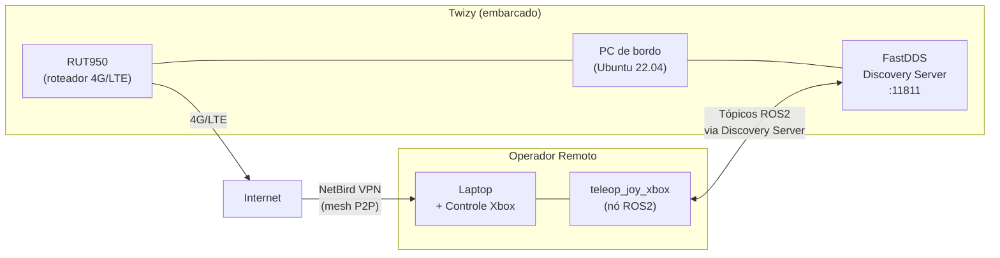

# Rede

O Twizy utiliza um roteador industrial **Teltonika RUT950** 4G/LTE como gateway de rede embarcado, combinado com uma **VPN mesh NetBird** para permitir acesso remoto seguro a todos os nós ROS2 de qualquer lugar com conexão à internet.

## Arquitetura



## Roteador RUT950

O **RUT950** da Teltonika fornece conectividade móvel ao veículo.


| Especificação | Valor |
|--------------|-------|
| Tecnologia | 4G LTE Cat 4 (até 150 Mbps download), 3G, 2G |
| SIM | Dual SIM com failover automático |
| WiFi | IEEE 802.11b/g/n (AP + STA) |
| Ethernet | 4 portas × 10/100 Mbps (1 WAN + 3 LAN) |
| CPU | Atheros Wasp, MIPS 74Kc, 550 MHz |
| RAM | 128 MB DDR2 |
| Armazenamento | 16 MB Flash |
| Alimentação | 9–30 VDC (conector industrial 4 pinos) |
| SO | RutOS (Linux baseado em OpenWrt) |
| Carcaça | Alumínio com painéis de plástico |


!!! note "Instalação física"
    As credenciais de WiFi/configuração do roteador estão em uma etiqueta na parte traseira do aparelho. É necessário modelar e imprimir em 3D uma estrutura de suporte para fixar o roteador na parte traseira do veículo.

!!! warning "Chip SIM"
    A conectividade foi validada com um chip de teste. É necessário adquirir um plano dedicado para uso em produção.

---

## VPN NetBird

O NetBird cria uma VPN mesh criptografada entre todos os dispositivos da equipe. Cada máquina recebe um hostname e IP estáveis na rede NetBird, independentemente da rede física ou NAT.

### Por que NetBird

- Não precisa de IP estático no veículo — o RUT950 tem IP 4G dinâmico
- Peer-to-peer quando possível (baixa latência), fallback via relay quando o NAT bloqueia conexão direta
- Funciona sobre 4G, WiFi e qualquer conexão à internet
- Plano gratuito disponível para equipes pequenas

### Instalação (todas as máquinas)

```bash
curl -fsSL https://pkgs.netbird.io/install.sh | sh
```

### Autenticação e conexão

```bash
# Gere um token no dashboard do NetBird e conecte:
sudo netbird up --setup-key <token_gerado>
```

### Verificação

```bash
netbird status
# Tanto o veículo quanto o laptop do operador devem aparecer como "Connected"

ping twizy
```

### Considerações de rede para ROS2

Os containers Docker do ROS2 devem usar `network_mode: host` para que o tráfego ROS2 seja roteado pela interface NetBird (`wt0`).

```yaml
services:
  carro:
    network_mode: host   # obrigatório — roteia ROS2 pela wt0 do NetBird
```

!!! warning "Conflito com interface GigE da câmera"
    O FastDDS Discovery Server deve ser configurado para escutar apenas na interface NetBird (`wt0`), **não** na interface GigE da câmera (`169.254.x.x`).

```bash
ip addr show wt0
# Deve mostrar um endereço 100.x.x.x atribuído pelo NetBird
```

---

## FastDDS Discovery Server

O ROS2 padrão depende de multicast para descoberta de nós, o que não funciona através de túneis VPN ou entre máquinas em redes diferentes. A solução é um **FastDDS Discovery Server centralizado** rodando no veículo, com o qual todos os nós (locais e remotos) se registram via unicast.

### Como funciona

```mermaid
sequenceDiagram
    participant V as PC do Veículo
    participant DS as Discovery Server (porta 11811)
    participant O as Operador Remoto

    V->>DS: registrar nós (local, via 127.0.0.1 ou wt0)
    O->>DS: registrar nós (via IP NetBird)
    DS-->>V: lista de peers
    DS-->>O: lista de peers
    V<-->>O: troca de tópicos ROS2 (unicast)
```

### Configuração no veículo

```dockerfile
FROM ros:humble-ros-core
RUN apt-get update && apt-get install -y \
    ros-humble-rmw-fastrtps-cpp \
    fastdds-tools \
    && rm -rf /var/lib/apt/lists/*
ENTRYPOINT ["fastdds", "discovery"]
```

```yaml
services:
  discovery-server:
    build:
      context: .
      dockerfile: Dockerfile.server
    container_name: fastdds_server
    network_mode: "host"        # obrigatório para acessar interface wt0 do NetBird
    command: -i 0               # ID do servidor de descoberta 0
    restart: unless-stopped
```

```bash
docker compose up -d discovery-server

# Ou sem Docker:
source /opt/ros/humble/setup.bash
fastdds discovery -i 0
```

!!! warning "Conflito com interface GigE da câmera"
    Executar o Discovery Server sem vinculá-lo a uma interface específica fazia com que ele anunciasse na interface GigE da câmera (`169.254.x.x`), bloqueando as conexões da câmera.

### Variáveis de ambiente

**Lado do veículo:**

```bash
ROS_DOMAIN_ID=0
RMW_IMPLEMENTATION=rmw_fastrtps_cpp
```

**Lado do operador:**

```bash
export ROS_DISCOVERY_SERVER=twizy:11811   # hostname NetBird do veículo
export ROS_SUPER_CLIENT=true              # desativa multicast, força uso exclusivo do Discovery Server
export ROS_DOMAIN_ID=0
export RMW_IMPLEMENTATION=rmw_fastrtps_cpp
```

| Variável | Valor | Descrição |
|----------|-------|-----------|
| `ROS_DISCOVERY_SERVER` | `twizy:11811` | Hostname NetBird (ou IP) do veículo com o servidor |
| `ROS_DOMAIN_ID` | `0` | Deve ser idêntico em todas as máquinas da rede |
| `ROS_SUPER_CLIENT` | `true` | Desativa multicast, força uso exclusivo do Discovery Server |
| `RMW_IMPLEMENTATION` | `rmw_fastrtps_cpp` | Define o FastDDS como middleware ROS2 |

### Verificação

```bash
ros2 topic list
# Deve mostrar os tópicos do veículo
```
