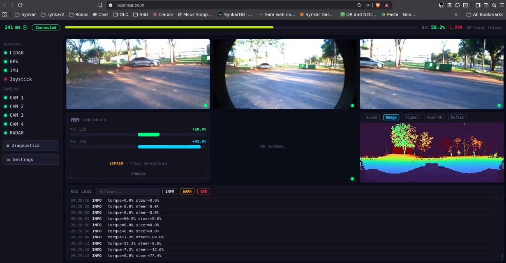

# Dashboard Web de Teleoperação

Interface de navegador para dirigir e monitorar o Twizy remotamente: três câmeras frontais,
visualizações do LiDAR e controle por teclado. É o caminho usado atualmente em campo, no lugar
do controle Xbox descrito em [Teleoperação Remota](index.md).

Acesso: **http://localhost:5000** depois de subir a ponte.



*Interface em operação real: as três câmeras frontais, a panorâmica Range do LiDAR e o log de
comandos com os valores de torque e esterço efetivamente aplicados no veículo.*

## Por que existe uma ponte SSH

A arquitetura original enviava os tópicos ROS 2 diretamente pela VPN, usando o
[Discovery Server](../networking/discovery-server.md). Isso deixou de entregar dados: os clientes
remotos **descobrem** os tópicos normalmente (`ros2 topic list` lista tudo), mas o pareamento de
endpoints não completa — o publicador do veículo reporta `Subscription count: 0` mesmo com um
assinante remoto ativo, e nenhum dado de usuário trafega.

O diagnóstico descartou rede como causa: 0% de perda de pacotes, UDP nos dois sentidos até 8 KB,
e os pacotes de descoberta chegando ao destino. Um assinante **local** dentro do veículo recebe
os frames sem problema; qualquer assinante **remoto** não recebe. O comportamento afeta todas as
máquinas de operador testadas.

!!! tip "Pista para a causa raiz: a whitelist de interfaces no veículo"
    O Fast DDS do veículo já foi deliberadamente restrito a uma única interface. O motivo original
    foi outro problema: ele subia em **todas** as interfaces de rede do carro e conflitava com as
    placas GigE das câmeras, impedindo a conexão delas. A correção da época foi isolá-lo na
    interface da VPN.

    Restringir a interface **do lado do operador** já foi testado e não resolveu — só quebrou a
    descoberta. O que ainda **não** foi verificado é o perfil do lado do veículo: se ele anuncia
    apenas locators de uma interface específica, o pareamento com um assinante remoto pode não
    completar mesmo com a descoberta funcionando.

    Outra suspeita registrada é o kernel do computador de bordo, que mudou de versão pouco antes de
    o problema aparecer. Reiniciar `discovery_server` e depois os nós recupera a **descoberta**, mas
    não os **dados** — o que aponta para algo abaixo da camada de descoberta.

    Revise o XML do Fast DDS no veículo antes de considerar a ponte SSH definitiva.

A solução em uso transporta os dados por **SSH** (TCP, confiável) e mantém o DDS restrito a cada
lado, onde ele funciona:

```
VEÍCULO                                SSH (sobre VPN)            OPERADOR
──────────────────────────────────────────────────────────────────────────────
car_sensors.py (câmeras)  ─┐
car_sensors.py (LiDAR)    ─┴── frames ═══════════════════> pc_rx.py ─┐
                                                                     │ DDS local
car_control.py <────────────── JSON  <═══════════════ pc_tx.py <─────┴─ dashboard
    │                                                                   (Flask :5000)
    └─> /direct_control_cmd ─> SD-VehicleInterface ─> CAN
```

!!! note "Dois pipes de sensores, não um"
    Os containers do veículo não trocam dados entre si por memória compartilhada (cada um tem seu
    próprio `/dev/shm`). Por isso as câmeras são lidas de dentro de `air_twizy_camera` e o LiDAR de
    dentro de `ouster_lidar`, em pipes separados.

## Relays de redução no veículo

A banda da VPN não comporta os dados brutos: cada câmera sozinha exigiria cerca de 800 Mbps
(2048×1536 bayer a 30 FPS) e a nuvem do Ouster cerca de 16 MB/s. Três relays rodam **dentro dos containers do veículo**,
comprimindo antes de enviar. O regime estável observado fica na ordem de dezenas de KB/s no total.

| Relay | Container | Entrada | Saída |
|---|---|---|---|
| `cam_compress_relay.py` | `air_twizy_camera` | `/camera/top_{left,front,right}/image_raw` (bayer 2048×1536) | mesmos tópicos com sufixo `/compressed` — JPEG 320 px, q40, 10 fps, rotação 180° |
| `lidar_topdown_relay.py` | `ouster_lidar` | `/ouster/points` (PointCloud2) | `/lidar/topdown` — `Float32MultiArray`, até 300 pontos, 2,5 Hz |
| `lidar_img_relay.py` | `ouster_lidar` | panorâmicas do Ouster | `/ouster/<range\|signal\|nearir\|reflec>_image/compressed` — JPEG 384 px, q30, 0,5 fps |

!!! warning "Os relays são temporários"
    São injetados via `docker exec` e **não sobrevivem** ao reinício ou recriação dos containers.
    O script de inicialização sempre os reenvia. Integrá-los ao compose do veículo continua pendente.

## Instalação na máquina do operador

A ponte não faz parte do repositório de hardware — são scripts que ficam na máquina de quem opera,
no diretório `~/twizy-ssh-bridge/` (peça a cópia a quem já opera; o conteúdo está versionado no
snapshot funcional do projeto).

**Pré-requisitos:**

| Requisito | Como verificar |
|---|---|
| Linux com Docker | `docker --version` |
| NetBird conectada à rede do projeto | `netbird status` e `ping 100.122.121.134` |
| Acesso SSH ao veículo por chave, sem senha | `ssh air@twizy` deve entrar direto |
| Imagem `air-twizy-dashboard:latest` no Docker local | `docker images \| grep air-twizy-dashboard` |

A imagem é `ros:humble-ros-base` mais Flask, Pillow e o pacote `sd_msgs` compilado — é ela que
fornece a mensagem `DirectControl` e o ambiente ROS 2 dos dois lados da ponte.

**Arquivos do diretório:**

| Arquivo | Onde roda | Função |
|---|---|---|
| `start.sh` / `stop.sh` | operador | sobem e derrubam tudo |
| `car_sensors.py` | veículo (`air_twizy_camera` e `ouster_lidar`) | lê os tópicos e escreve os frames no stdout |
| `car_control.py` | veículo (`twizy`) | lê JSON do stdin e publica `/direct_control_cmd` |
| `pc_rx.py` | operador (container `twizy_bridge`) | recebe os frames e republica no DDS local |
| `pc_tx.py` | operador (container `twizy_bridge`) | assina o comando local e envia ao veículo |

Os scripts do lado do veículo são **enviados a cada execução** do `start.sh`, então não é preciso
instalá-los lá — e é por isso que a ponte se recupera sozinha depois de um reinício de container.

**O que esperar no terminal:** o `start.sh` imprime a sequência de etapas (relays, envio dos
scripts, container da ponte, dois pipes de sensores, pipe de controle, dashboard) e termina com o
endereço `http://localhost:5000`. Os logs dos pipes ficam em `rx.log`, `rx_lidar.log` e `tx.log`
no próprio diretório; um contador de frames crescendo neles indica que os dados estão fluindo.

## Como subir

```bash
~/twizy-ssh-bridge/start.sh
```

O script cuida de tudo na ordem: garante os relays no veículo, envia os scripts da ponte, sobe o
container intermediário, abre os pipes SSH e inicia o dashboard.

Para derrubar:

```bash
~/twizy-ssh-bridge/stop.sh
```

## Controles

Clique na página primeiro — o teclado só responde com a aba em foco.

| Tecla | Ação |
|---|---|
| **W** / **S** | acelerar / frear |
| **A** / **D** | virar à esquerda / direita |
| **Espaço** | freio de emergência (torque negativo, não inércia) |
| **I** / **O** | aumenta / diminui o teto de aceleração |
| **K** / **L** | aumenta / diminui o teto do volante |

## Painel de ajustes

O botão **AJUSTES**, no card de controles, abre os parâmetros de condução. Todos valem
imediatamente, sem reiniciar nada, e o botão de restaurar volta aos padrões.

| Parâmetro | Padrão | Significado |
|---|---|---|
| Acelerador: arranque | 5% | valor aplicado no instante em que W é pressionado (vence a zona morta) |
| Acelerador: máximo | 40% | teto do torque |
| Acelerador: rampa | 40 %/s | quão rápido sobe do arranque até o teto |
| Freio: arranque / máximo | 10% / 100% | equivalentes para S |
| Freio: rampa | 400 %/s | |
| Desaceleração (solto) | 100 %/s | queda do torque com nenhuma tecla pressionada |
| Freio de emergência | 100% | intensidade aplicada pelo Espaço |
| Volante: máximo | 100% | teto do esterço |
| Volante: rampa / retorno | 80 / 80 %/s | velocidade de virar e de voltar ao centro |

## O que a interface mostra

- **Três câmeras frontais** (esquerda, centro, direita), a cerca de 4,5 quadros por segundo.
- **Top view do LiDAR** em abas: *Nuvem* (vista superior) e as panorâmicas 360° *Range*, *Signal*,
  *Near-IR* e *Reflec*.
- Barras de torque e esterço, estado dos sensores e log do ROS.

## Solução de problemas

| Sintoma | Causa provável |
|---|---|
| Tudo em "NO SIGNAL" | Veículo desligado, VPN caída ou relays parados — rode `start.sh` de novo |
| Controle não responde | A aba do navegador está sem foco; clique na página |
| Interface com aparência antiga | Cache do navegador; recarregue com **Ctrl+Shift+R** |
| LiDAR sem publicar após ligar o carro | Corrida de inicialização do driver Ouster: `docker restart ouster_lidar` |
| Imagens travando | Banda da VPN saturada — normal quando o enlace P2P degrada |

## Segurança

O controle é real. Com o veículo armado e em Drive, **W acelera de verdade**. Leia
[Segurança na Operação](../vehicle/safety.md) antes do primeiro teste — inclui o procedimento de
retomada de controle, o checklist pré-operação e o encerramento seguro. Opere sempre com um
piloto de segurança a bordo. Nunca envie comandos de aceleração por scripts ou `curl` para
testar a cadeia — valide sempre por leitura (`ros2 topic echo /direct_control_cmd`).

Lembre-se de que o veículo **não se move com a marcha em Park ou Neutral**: o software não comanda
a marcha, ela precisa ser selecionada fisicamente. Veja [Operação do Veículo](../vehicle/operation.md).
