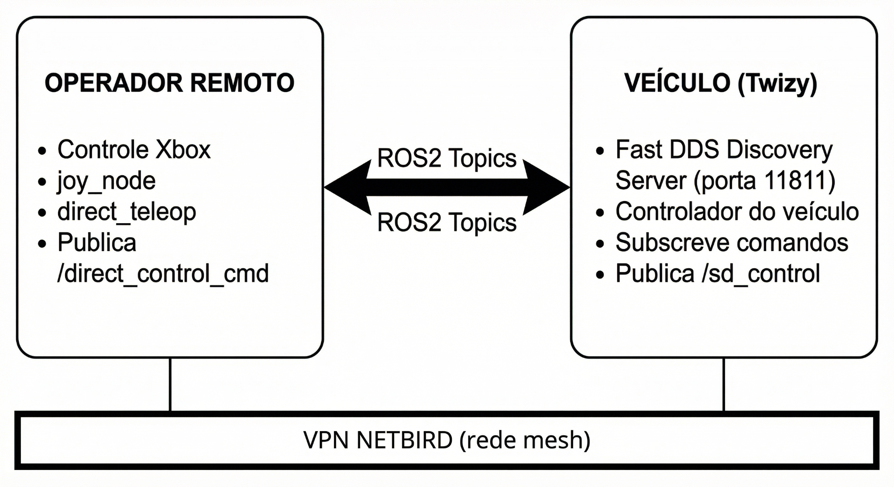

# Remote Teleoperation

The Twizy supports remote teleoperation via an Xbox controller connected to an operator laptop anywhere with internet access. Communication happens through the [NetBird VPN](../networking/netbird.md) and a [FastDDS Discovery Server](../networking/discovery-server.md) on the vehicle.

## System Overview



```
REMOTE OPERATOR                          VEHICLE (Twizy)
─────────────────────────────────────────────────────────
Xbox Controller                          FastDDS Discovery Server
     │                                         │ (port 11811)
  joy_node                              Vehicle controller nodes
     │                                         │
direct_teleop ──── /direct_control_cmd ──► SD-VehicleInterface
                ◄── /sd_control ──────────────┘
        └─────────── VPN NETBIRD (mesh) ───────┘
```

**Command flow:**

1. Operator sends torque and steering setpoints via `/direct_control_cmd`
2. Vehicle PC subscribes, applies commands to the Twizy via CAN, and publishes current state to `/sd_control`
3. The Discovery Server on the vehicle converts multicast ROS2 traffic to unicast, enabling cross-VPN communication

## Requirements

| Component | Version | Role |
|-----------|---------|------|
| OS | Ubuntu 22.04 LTS | Base for ROS2 Humble |
| ROS2 Middleware | `rmw_fastrtps_cpp` | Required for Discovery Server |
| VPN | NetBird (latest) | Mesh P2P communication |
| Containerization | Docker 24.x+ | Environment isolation |

**Hardware:**
- Operator: laptop with USB or Bluetooth Xbox controller
- Vehicle: on-board PC connected to Twizy CAN bus
- Both sides need internet access for the VPN

## Operation Procedure

### On the vehicle

```bash
# 1. Verify NetBird is connected and note the IP
netbird status

# 2. Start the Discovery Server
docker compose up -d discovery-server

# 3. Start the vehicle control nodes (subscribes /direct_control_cmd, publishes /sd_control)
docker compose up -d carro
```

### On the operator machine

```bash
# 1. Verify NetBird connectivity
ping twizy

# 2. Set environment variables
export ROS_DISCOVERY_SERVER=twizy:11811   # NetBird hostname of the vehicle
export ROS_SUPER_CLIENT=true
export ROS_DOMAIN_ID=0
export RMW_IMPLEMENTATION=rmw_fastrtps_cpp

# 3. Start the teleop stack
docker compose up -d

# 4. Verify topics are visible
ros2 topic list
# Should show /direct_control_cmd and /sd_control
```

## ROS2 Package Structure

```
ws/
├── teleop_joy_xbox/          # Teleoperation package
│   ├── config/
│   │   └── xbox_controller.yaml
│   ├── launch/
│   │   ├── xbox_teleop.launch.py      # Mode 1: Twist (cmd_vel)
│   │   └── direct_teleop.launch.py    # Mode 2: Direct Control
│   └── teleop_joy_xbox/
│       ├── xbox_teleop_node.py
│       └── direct_teleop.py
└── sd_msgs/                  # Custom messages
    └── msg/
        ├── DirectControl.msg
        └── SDControl.msg
```

## Control Modes

### Mode 1 — Standard Twist

```bash
ros2 launch teleop_joy_xbox xbox_teleop.launch.py
```

- Message type: `geometry_msgs/Twist`
- Topic: `/cmd_vel`
- Use: generic mobile robots

### Mode 2 — Direct Control (recommended for Twizy)

```bash
ros2 launch teleop_joy_xbox direct_teleop.launch.py
```

- Messages: `sd_msgs/DirectControl` (commands), `sd_msgs/SDControl` (feedback)
- Topics: `/direct_control_cmd` → `/sd_control`
- Use: direct torque and steering control of the vehicle

---

## Xbox Controller Interface

The teleoperation stack uses an Xbox controller (USB or Bluetooth) on the operator's machine to generate drive commands sent to the vehicle over the NetBird VPN.

### Button Mapping (Direct Control mode)

| Command | Button/Axis | Technical Description |
|---------|------------|----------------------|
| Accelerate | RT (Right Trigger) | Sets positive torque setpoint |
| Brake | LT (Left Trigger) | Sets negative torque setpoint |
| Steer | Left Analog Stick | Controls front wheel angle |
| Safety center | LB button | Immediately centers steering |
| Increase speed limit | Y button | Raises maximum velocity limit |
| Decrease speed limit | B button | Lowers maximum velocity limit |
| Increase brake intensity | X button | Increases braking force |
| Decrease brake intensity | A button | Decreases braking force |

!!! note "Speed-dependent steering"
    `direct_teleop` applies a lookup table that automatically limits the steering angle as vehicle speed increases — wider turns are blocked at high speed.

### Custom ROS2 Messages

#### DirectControl.msg (operator → vehicle)

```
float64 linear_velocity    # linear velocity (optional)
float64 torque_setpoint    # -100 (full brake) to +100 (full throttle)
float64 steer_setpoint     # -100 (right) to +100 (left)
```

#### SDControl.msg (vehicle → operator, feedback)

```
std_msgs/Header header
float64 steer              # current steering angle
float64 torque             # current torque
float64 current_velocity   # measured vehicle speed
float64 target_velocity    # target speed setpoint
int32   p, d, i, ff        # velocity PID terms
int32   steer_p, steer_i, steer_d  # steering PID terms
float64 steer_actual       # actual steering angle from sensor
```

### Joystick device access in Docker

The teleop container needs access to the host's input devices:

```yaml
volumes:
  - /dev/input:/dev/input:rw    # access to input drivers
  - /run/udev:/run/udev:ro      # correct joystick identification via udev
devices:
  - /dev/input                  # explicit permission for Xbox controller
```

### Verifying the joystick is detected

```bash
# On the host (before starting Docker)
ls /dev/input/js*
# Should show /dev/input/js0 (or similar)

# Inside the container
ros2 run joy joy_node --ros-args -r /joy:=joy_teleop_test
ros2 topic echo /joy_teleop_test
# Move a stick — values should change in the output
```

## Docker Compose (operator side)

```yaml
services:
  discovery-server:
    build:
      context: .
      dockerfile: Dockerfile.server
    container_name: fastdds_server
    network_mode: "host"
    command: -i 0
    restart: unless-stopped

  teleop-client:
    build:
      context: .
      dockerfile: Dockerfile.client
    container_name: ros2_teleop_joy
    network_mode: "host"
    depends_on:
      - discovery-server
    environment:
      - ROS_DISCOVERY_SERVER=twizy:11811
      - ROS_DOMAIN_ID=0
      - ROS_SUPER_CLIENT=true
      - RMW_IMPLEMENTATION=rmw_fastrtps_cpp
    volumes:
      - ./ws:/root/ros2_ws/src:rw
      - /dev/input:/dev/input:rw
      - /run/udev:/run/udev:ro
    devices:
      - /dev/input
    command: ros2 run joy joy_node --ros-args -r /joy:=joy_teleop_test
```

!!! important "network_mode: host is mandatory"
    Without `network_mode: host`, Docker routes traffic through its bridge network instead of the NetBird interface (`wt0`). The ROS2 nodes would never reach the Discovery Server on the vehicle.
